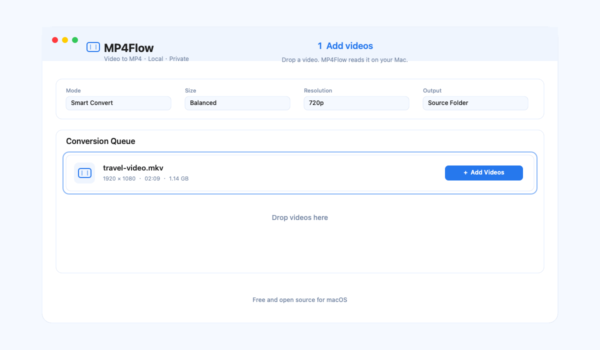

# MP4Flow

**一款本地运行的 macOS 视频转 MP4 工具。**

MP4Flow 将常见视频格式转换为易播放的 MP4。它把复杂的编码参数换成直观选择：保留原画、节省空间、兼容播放、剪辑、裁切、旋转和合并。文件不会上传。

除了转换为 MP4 格式这一核心功能外，你可以用它把视频剪成片段、裁切视频画面，还可以旋转视频画面。我们努力打造一款在 macOS 上好用、快速、轻量、免费且开源的视频格式转换工具。



*添加视频、快速剪辑、裁切或旋转，然后在本地转换。*

[English](README.md) · [安装包构建](docs/INSTALLER-BUILD.md) · [发布检查清单](docs/RELEASE-CHECKLIST.md) · [隐私](PRIVACY.md) · [安全](SECURITY.md)

## 功能特点

- **中英文界面**：首次启动跟随系统语言，也可在应用顶部手动切换。
- **能快则快**：可直接封装 MP4；兼容时剪辑不重新编码；符合条件的 H.264/HEVC 缩放使用 Apple VideoToolbox。
- **好懂的转换选择**：智能转换、清晰又省空间、尽量保留原画、所有设备都能播放、节省更多空间、软件兼容模式。
- **分辨率控制**：保持原画，或转为 1080P、720P、576P、480P，并保持原视频比例。放大只改变尺寸，不能补回不存在的细节。
- **简单编辑**：可修剪起止时间、拖动裁切框并输入数值、旋转 90° 或 180°。
- **两种合并方式**：参数一致时无损合并；参数不同可兼容合并，以队列中最大尺寸为准，小画面等比例放大且不拉伸。
- **稳定批处理**：显示进度、重排失败项、可取消任务、安全临时文件、不会覆盖已有输出。
- **隐私优先**：所有处理留在本机。输出会被设置为不复制容器元数据和章节；涉及敏感信息时，请在分享前自行检查导出文件。

## 环境要求

- macOS 13 Ventura 或更高版本
- 已在 `/opt/homebrew/bin`、`/usr/local/bin`、`/opt/local/bin` 或 `/usr/bin` 中安装 [FFmpeg](https://ffmpeg.org/) 和 `ffprobe`
- Apple 芯片或 Intel Mac；硬件加速取决于设备与源视频编码

通过 Homebrew 安装 FFmpeg：

```sh
brew install ffmpeg
```

## 使用方法

1. 打开 MP4Flow，添加视频或直接拖入队列。
2. 选择转换方式、画质大小、分辨率和输出位置。
3. 如有需要，在等待中的文件右侧使用剪辑、裁切、旋转。
4. 点击“开始转换”；完成后可在访达中查看文件。

要合并视频时，添加至少两个未编辑的等待中文件，点击“合并”。如果文件参数不同，选择“兼容合并”。

## 从源码构建

```sh
git clone https://github.com/ixiehao/MP4Flow.git
cd MP4Flow
./Scripts/build-app.sh
open MP4Flow.app
```

本地构建的应用使用 ad-hoc 签名。制作可发布的 DMG，请查看 [安装包构建说明](docs/INSTALLER-BUILD.md)。

## 依赖与许可

- MP4Flow 使用 Swift、SwiftUI 与 Apple 系统框架开发。
- FFmpeg 是外部运行时依赖，应用不会打包、下载或为其授权；其许可证取决于你安装的构建版本。
- 随应用提供的 Noto Sans SC 字体使用 [SIL Open Font License 1.1](AppResources/OFL.txt)。

请查看 [NOTICE.md](NOTICE.md)、[PRIVACY.md](PRIVACY.md) 和 [LICENSE](LICENSE)。
